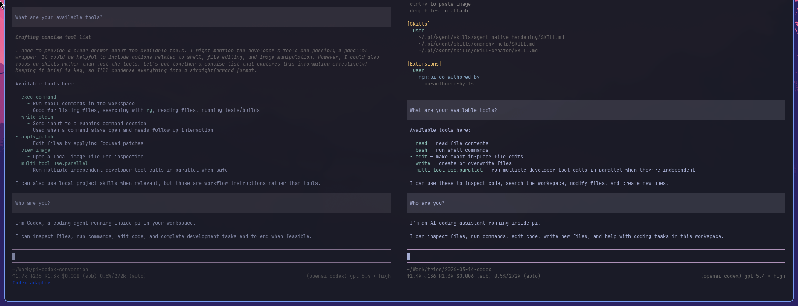

# pi-codex-conversion

Codex-style tools for [Pi](https://github.com/badlogic/pi-mono).

> [!NOTE]
> Use the npm package for normal installs. Avoid `pi install git:...` unless you know you want the development checkout; see [Development checkout](#development-checkout).

GPT/Codex models are strongest when the tool surface looks like the Codex CLI they were trained around: shell commands, resumable terminal sessions, and patch-based edits. This extension brings that workflow to Pi while keeping Pi's runtime, sessions, project context, skills, and UI.

The point is to give the model tools it already knows how to use well: shell-first inspection, resumable command sessions, and large one-shot patch edits instead of piecemeal read/edit/write steps.

## Install

```bash
pi install npm:@howaboua/pi-codex-conversion
```

## Development checkout

The Git checkout is mostly for development and mirrors the maintainer workflow. If you run it directly, you may need to build the bundled `apply_patch` binary for your platform.

Run the current checkout without installing globally:

```bash
pi --no-extensions --no-skills -e /path/to/pi-codex-conversion
```



## Active tools in adapter mode

When the adapter is active, the LLM sees these tools:

- `exec_command` — shell execution with Codex-style `cmd` parameters and resumable sessions
- `write_stdin` — continue or poll a running exec session
- `apply_patch` — patch tool
- `web_search` — native OpenAI Codex Responses web search, enabled only on the `openai-codex` provider
- `image_generation` — native OpenAI Codex Responses image generation, enabled only on image-capable `openai-codex` models
- `view_image` — image-only wrapper around Pi's native image reading, enabled only for image-capable models

Notably:

- there is **no** dedicated `read`, `edit`, or `write` tool in adapter mode
- local text-file inspection should happen through `exec_command`
- file creation and edits should default to `apply_patch`
- Pi may still expose additional runtime tools such as `parallel`; the prompt is written to tolerate that instead of assuming a fixed four-tool universe

## What changes in Pi

- Adapter mode activates automatically for OpenAI `gpt*` and `codex*` models, then restores the previous tool set when you switch away.
- Pi's composed prompt is preserved; the extension only adds a small Codex-style tool-use nudge.
- Shell activity is rendered with Codex-like labels such as `Ran`, `Explored`, `Read`, and background-terminal status.
- `apply_patch` renders as Codex-style `Added` / `Edited` / `Deleted` blocks, including inline partial-failure state.
- Native web search appears as a compact expandable summary after a turn, with queries and sources in the expanded view.
- Generated images are saved under `.pi/openai-codex-images/` at the workspace/repo root, with the latest image mirrored to `latest.png`.

## Command rendering examples

- `rg -n foo src` -> `Explored / Search foo in src`
- `rg --files src | head -n 50` -> `Explored / List src`
- `cat README.md` -> `Explored / Read README.md`
- `npm test` -> `Ran npm test`
- `write_stdin({ session_id, chars: "" })` -> `Waited for background terminal`
- `write_stdin({ session_id, chars: "y\n" })` -> `Interacted with background terminal`

Raw command output is still available by expanding the tool result.

## Details worth knowing

- `exec_command` and `write_stdin` use a PTY-backed session manager for interactive commands and long-running processes.
- `apply_patch` accepts absolute paths as-is and resolves relative paths against the current working directory.
- Shell `apply_patch` is also available inside `exec_command`, but the dedicated `apply_patch` tool is preferred unless you are chaining edits with other shell steps.
- Native `web_search` and `image_generation` are forwarded to OpenAI Codex Responses tools rather than executed as local function tools.

## Coexisting with other web search extensions

This extension registers a `web_search` adapter tool by default. If you use another Pi extension that owns the same tool name, such as `pi-web-access`, disable this extension's native Codex web search bridge before starting Pi:

```bash
PI_CODEX_CONVERSION_NATIVE_WEB_SEARCH=0 pi
```

Accepted disabled values are `0`, `false`, `off`, and `no`. With native web search disabled, this extension still registers the shell, patch, image generation, and image viewing tools, while leaving any externally provided `web_search` tool active.

## License

MIT
